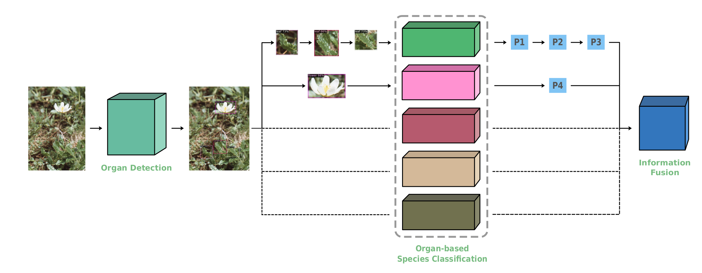

<p align="center">

  <h1 align="center">DARMA: Detection as A Reinforced Means of Attention </h1>
  <p align="center">
    <a href="https://scholar.google.com/citations?user=9qhuyZcAAAAJ&hl=en"><strong>Matthew Keaton</strong></a>
    ·
    <a href="https://scholar.google.com/citations?user=3Tx_N4YAAAAJ&hl=en&oi=ao"><strong>Ram Zaveri</strong></a>
    ·
    <a href=""><strong>Meghana Kovur</strong></a>
    ·
    <a href=""><strong>Cole Henderson</strong></a>
    ·
    <a href="https://vision.csee.wvu.edu/~doretto/"><strong>Gianfranco Doretto</strong></a>
    
  </p>

  <h4 align="center"><a href="https://arxiv.org/pdf/2106.02141.pdf">Paper</a> | <a href="https://arxiv.org/abs/2106.02141">arXiv</a> | <a href="">Project Page</a></h4>
  <div align="center"></div>
</p>

<p align="center">

</p>

### Challenge
We tackle the challenege of "fine-grained visual classification of plant species in the wild" using the data from the challenge [PlantCLEF2015](https://www.imageclef.org/lifeclef/2015/plant). Here, we reinforce the classification task by reducing the classification to various plant organs and then fusing the final results. We do that by performing object detection onto those organs. We make our curated data and our annotation tool publicly available in the following section. 

### Curated Data

Please download the data from our shared Google Drive [link](https://drive.google.com/drive/folders/1NKteWNjgv-bsJ908dTsjaHJAte-Z2_Y3?usp=sharing). We collect data from the challenge [PlantCLEF2015](https://www.imageclef.org/lifeclef/2015/plant), and annotate plant organs using our custom-made [annotation tool](https://github.com/wvuvl/snappy_annotator) in the following classes:
- `leaf`
- `fruit`
- `flower`
- `bark`
- `HDL`: High Density Leaves

The challenge provides two splits:
- `train`
- `test`

The `train` set provides 1000 species to train on and the `test` set provides 975 species to evaluate on. Additionally, the data is skewed; therefore, we further scrap the internet for more data which we also make available through our shared Google Drive [link](https://drive.google.com/drive/folders/1NKteWNjgv-bsJ908dTsjaHJAte-Z2_Y3?usp=sharing). The splits are in the following format:
- `train_split.zip` : train split
- `train_extra_web_images.zip` : additional train data through web scrapping
- `test_split.zip`: test split

Each of them contain data in the following format:
- `<split>/species`
    - \<id\>.jpg : image
    - \<id\>.xml : corresponding metadata
    - \<id\>_annotations.xml: corresponding annotations

Note: the data from the internet does not have metadata.


```bibtex
@article{keaton2021fine,
  title={Fine-grained visual classification of plant species in the wild: Object detection as a reinforced means of attention},
  author={Keaton, Matthew R and Zaveri, Ram J and Kovur, Meghana and Henderson, Cole and Adjeroh, Donald A and Doretto, Gianfranco},
  journal={arXiv preprint arXiv:2106.02141},
  year={2021}
}
```
